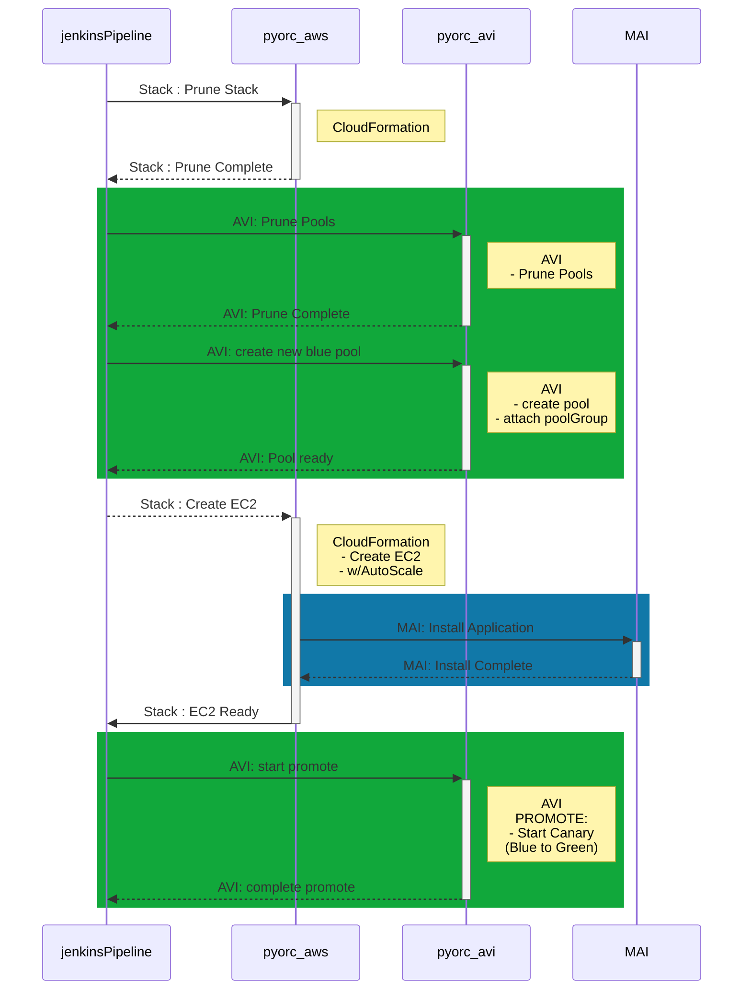

```mermaid
sequenceDiagram


    participant jenkinsPipeline
    participant pyorc_aws
    participant pyorc_avi
    participant MAI

    
    jenkinsPipeline->>+pyorc_aws: Stack : Prune Stack
        Note right of pyorc_aws: CloudFormation
    pyorc_aws-->>-jenkinsPipeline: Stack : Prune Complete
            

    rect rgb(17, 168, 59)
        jenkinsPipeline->>+pyorc_avi: AVI: Prune Pools
            Note right of pyorc_avi: AVI <br>- Prune Pools
        pyorc_avi-->>-jenkinsPipeline: AVI: Prune Complete
    
        jenkinsPipeline->>+pyorc_avi: AVI: create new blue pool
            Note right of pyorc_avi: AVI <bR>- create pool<br>- attach poolGroup
        pyorc_avi-->>-jenkinsPipeline: AVI: Pool ready
    end

    jenkinsPipeline-->>+pyorc_aws: Stack : Create EC2
        Note right of pyorc_aws: CloudFormation <br>- Create EC2 <br> - w/AutoScale
            rect rgb(17, 120, 168)
                pyorc_aws->>+MAI: MAI: Install Application
                MAI-->>-pyorc_aws: MAI: Install Complete
            end
    pyorc_aws->>-jenkinsPipeline: Stack : EC2 Ready

    rect rgb(17, 168, 59)
        jenkinsPipeline->>+pyorc_avi: AVI: start promote
            Note right of pyorc_avi:AVI <br>PROMOTE:<br> - Start Canary <br> (Blue to Green)
        pyorc_avi-->>-jenkinsPipeline: AVI: complete promote
    end


```